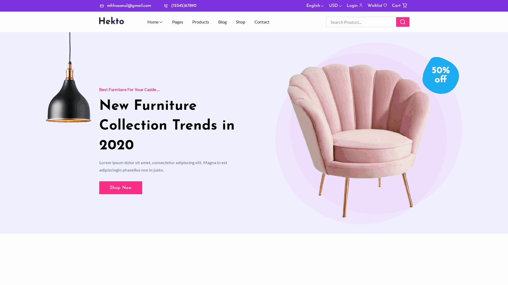

  

<h1 align="center">
⭐ Hekto • E-Commerce Landing Page
</h1>

> A pixel-perfect e-commerce landing page meticulously crafted from a Figma design, demonstrating strong attention to detail and design fidelity.

---

## 📸 Showcase

  

## 🔷 Project Overview
<table>
<tr><td>Type</td><td>personal project</td></tr>
<tr><td>My Role</td><td>front-end</td></tr>
<tr><td>Platform</td><td>website</td></tr>
<tr><td>Duration</td><td>dec 13 - dec 28</td></tr>
<tr><td>Status</td><td>archived</td></tr>
<tr><td>Version</td><td>1.0.0</td></tr>
<tr><td>Live Demo</td><td>No public live deployment available</td></tr>
</table>

## ⚙️ Tech Stack & Tools

<table>
  <tr>
    <td><strong>Frontend</strong></td>
    <td>
      
      
      
      
      
    </td>
  </tr>
  <tr>
    <td><strong>Backend</strong></td>
    <td><strong>No Backend</strong></td>
  </tr>
  <tr>
    <td><strong>Database</strong></td>
    <td><strong>No Database</strong></td>
  </tr>
  <tr>
    <td><strong>Hosting</strong></td>
    <td><strong>Not hosted at the moment</strong></td>
  </tr>
    <tr>
    <td><strong>Tools</strong></td>
    <td>
      
      
      
      
    </td>
  </tr>
</table>

## 💡 Problem / Motivation

Hekto was built after graduation as a practical exercise in translating professional Figma designs into clean, production-ready frontend code using React and Tailwind CSS. The goal was to improve UI implementation accuracy and strengthen my workflow for turning static designs into responsive interfaces.

## ✨ Key Features

- Translated Figma design into fully functional React components with pixel-perfect accuracy
- Implemented responsive layouts ensuring consistent experience across all screen sizes
- Built reusable UI components following DRY principles for maintainable codebase
- Optimized asset loading and rendering for improved performance metrics
- Independently translated Figma design to fully functional React application with responsive implementation

## 🚀 Future Improvements

- Add full e-commerce functionality with a complete frontend and backend integration.

## 🎨 Credits & Inspirations

- Front-end landing page developed by me
- Design sourced from Figma template

## 📝 Notes

- The project focuses primarily on frontend implementation and design accuracy rather than backend functionality.

---

  <em>This README was automatically generated using a custom README generator</em> ✨

